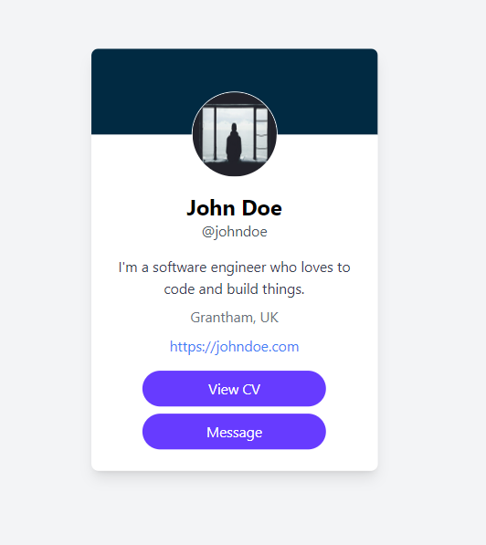
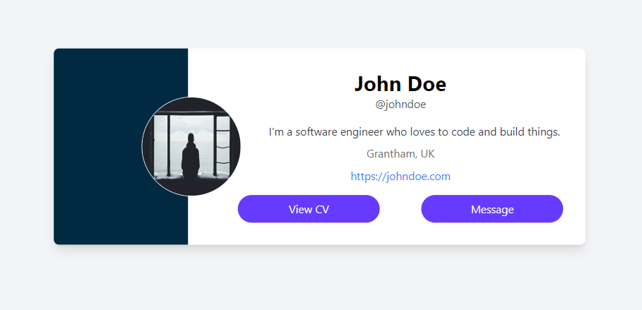
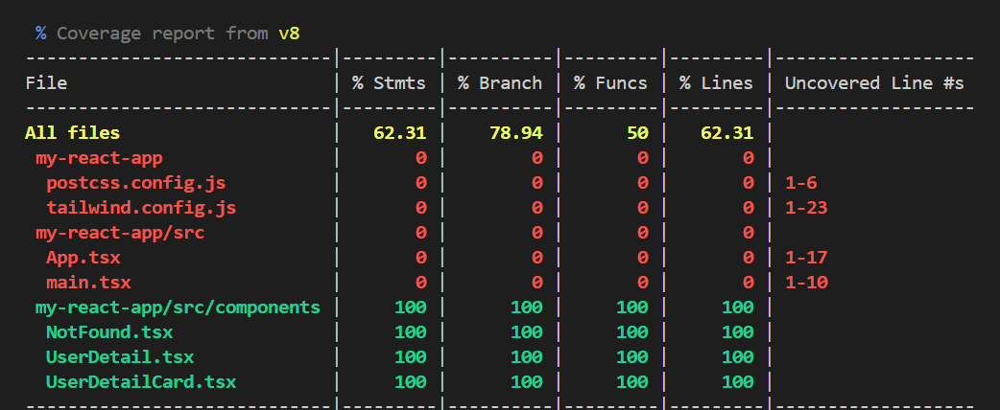

# Paylink Solutions

This project is a technical assessment that implements a user detail route rendering a 'profile card'. The application is built using React, TypeScript and Tailwind CSS, and it includes functionality for fetching and displaying user information based on a route parameter.

# High-Level Objectives

- Create a new application using React.
- Set up a user detail route with an optional 'userId' parameter.
- Fetch user data from a mock server endpoint using the route parameter on page initialization.
- Ensure the design is mobile responsive.
- Render different user information based on the 'userId' parameter.
- Implement test coverage using Vitest.

## Features

- User detail route that accepts a 'userId' parameter.
- Fetches and displays user data based on the 'userId' parameter.
- Mobile responsive design for the profile card.
- Test coverage using Vitest.

## Libraries / Tools Used

- React: Frontend library for building user interfaces.
- TypeScript: Typed superset of JavaScript that compiles to plain JavaScript.
- Tailwind CSS: Utility-first CSS framework for styling.
- Vitest: Testing framework for running and covering tests.
- Axios: Promise-based HTTP client for making API requests.

## Setup

1. Clone the repository:

```bash
git clone https://github.com/Stephenice/Paylink-Solutions.git
```

2. Install dependencies:

```bash
npm install
```

3. Start the development server:

```bash
npm run dev
```

4. Start the mock server:

```bash
npm run mockoon:start
```

## Running Tests

To run the tests and check for coverage, use the following command:

```bash
npm run test
```

To run the tests with a user interface, use:

```bash
npm run test:ui
```

## Frontend Functionality

- The application initializes by calling the mock server endpoint to fetch a user object based on the 'userId' route parameter.
- When the 'userId' parameter changes (e.g., from 1 to 2), the application fetches and displays the new user's information.
- The profile card displays user details such as name, email, and address.

## Screenshots

Include screenshots of the application here, showing both desktop and mobile views of the profile card.

Mobile views of the profile card
<br>

Desktop views of the profile card
<br>

Test coverage screenshot
<br>

## Future Work

- Improve the styling and design of the profile card.
- Implement features like dark mode & light mode toggle to update the styles to an alternative theme.
- Use React Query: Integrate React Query for data fetching, caching, and synchronization to improve the performance and usability of the application.
